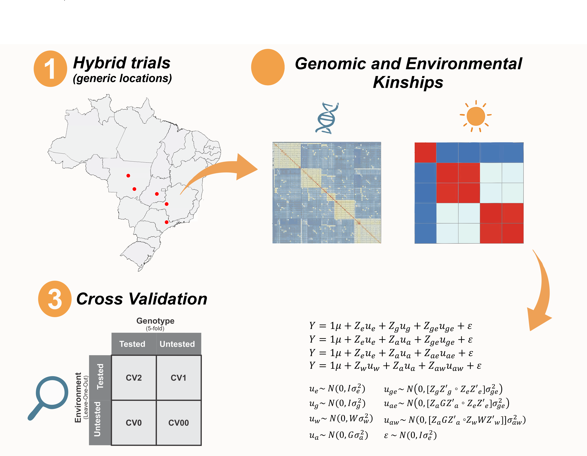

# MultiEnvGS-Demo
This repository contains practical R scripts to demonstrate genomic selection models across multiple environments, with a focus on applications in plant breeding education and training.

## What's Included (English)
1) Cross-validation functions: Scripts implementing different cross-validation schemes (CV0, CV00, CV1, and CV2) commonly used in genomic selection.
2) Bilingual instructions: Scripts with usage instructions available in both Portuguese (GS_Demo_ptbr.R) and English (GS_Demo_eng.R), including modeling code that uses the sommer package to perform multi-environment genomic selection.
3) Example datasets: Phenotypic (pheno_data.csv), genomic (Markers.Rda), and environmental data (W_matrix_USP_248) provided via https://github.com/gcostaneto/KernelMethods.

**Model specification**: The models used follow the structure:  
`y = u + e + g + g×e`  

Where:  
- `y`: phenotype  
- `u`: intercept  
- `e`: environmental effect or environmental covariates effects  
- `g`: genotypic or additive genomic effect  
- `g×e`: genotype-by-environment interaction 

##  O que está incluído (Português)
1) Funções de validação cruzada: Scripts que implementam diferentes esquemas de validação cruzada (CV0, CV00, CV1 e CV2), comumente usados na seleção genômica.
2) Instruções bilíngues: Scripts com instruções de uso disponíveis em português (GS_Demo_ptbr.R) e inglês (GS_Demo_eng.R), incluindo código de modelagem que utiliza o pacote sommer para realizar seleção genômica multiambiente.
3) Conjuntos de dados de exemplo: Dados fenotípicos (pheno_data.csv), genômicos (Markers.Rda) e ambientais (W_matrix_USP_248) disponíveis em https://github.com/gcostaneto/KernelMethods

**Especificação do modelo**: Os modelos seguem a estrutura:
`y = u + e + g + g×e`  

Onde:
- `y`: fenótipo
- `u`: intercepto
- `e`: efeito do ambiente ou efeitos de covariáveis ambientais
- `g`: efeito genotípico ou efeito genômico aditivo
- `g×e`: interação genótipo × ambiente

## Pipeline

## Functions
### fold
`fold(fold.n, n)`

- `fold.n`: fold.n: number of desired partitions (folds) for cross-validation. Should be ≥ 2.
- `n`: total number of observations to be split into folds.

Helper function that returns a list of indices for cross-validation splits.
Each list element contains the indices of observations assigned to one fold.
Used to divide data into roughly equal-sized subsets.

### mmes.fold  
`mmes.fold(dados, G, fold)`

- `dados`: data frame with phenotypic data containing 'gid' (genotype) and 'value' (phenotype) columns.  
- `G`: genomic additive relationship matrix (e.g., GBLUP matrix), with row and column names matching 'gid' levels.  
- `fold`: list of partitions generated by the `fold()` function.  

Performs cross-validation on single-environment data. For each fold, the function fits a mixed model with `mmes()`, masking phenotypes in the test fold. Returns predictive accuracy as the Pearson correlation between predicted and observed values in each fold.

### mmesCV  
`mmesCV(dados, G = NULL, W = NULL, CV = NULL, fold.n = 5, looEnv = TRUE, covGE = FALSE)`

- `dados`: phenotypic data frame containing 'gid' (genotype) and 'env' (environment) columns.  
- `G`: genomic additive relationship matrix.  
- `W`: environmental similarity matrix.  
- `CV`: cross-validation scheme identifier (e.g., '0', '1', '2', '00').  
- `fold.n`: number of folds (partitions) for CV. Default is 5.  
- `looEnv`: for CV = '00' only; indicates whether leave-one-out cross-validation is applied specifically to environments, while genotypes are partitioned separately into folds defined by fold.n.  
- `covGE`: logical, whether to construct GxE covariance structures following Jarquín et al. (2014).  

Performs cross-validation for multi-environment data.
Supports different CV schemes, including random folds, genotype-based, environment-based, and combined genotype-environment folds.
Fits mixed models with additive genomic and environmental covariance structures.
Returns accuracy metrics for predictions and GxE effects per fold.

##  Suggested References / Referências Sugeridas
- Jarquín, D., Crossa, J., Lacaze, X., Du Cheyron, P., Daucourt, J., Lorgeou, J., Piraux, F., Guerreiro, L., Pérez, P., Calus, M., Burgueño, J., de los Campos, G., 2014. A reaction norm model for genomic selection using high-dimensional genomic and environmental data. Theoretical and Applied Genetics 127, 595–607. https://doi.org/10.1007/s00122-013-2243-1

- Costa-Neto, G., Fritsche-Neto, R., Crossa, J., 2021a. Nonlinear kernels, dominance, and envirotyping data increase the accuracy of genome-based prediction in multi-environment trials. Heredity (Edinb) 126, 92–106. https://doi.org/10.1038/s41437-020-00353-1

- Covarrubias-Pazaran, G, 2025. Quantitative genetics using the sommer package. Available at: https://cran.r-project.org/web/packages/sommer/vignettes/sommer.qg.html
